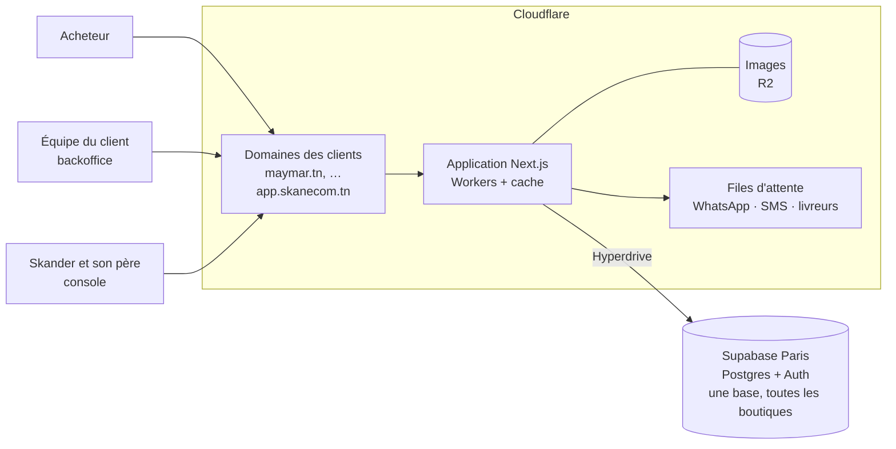

# SkanEcom — Infrastructure v0.2 (marque blanche, 10 à 50 clients)

> Statut : **proposition à valider par Skander**. Rédigé le 29/09/2026.
> Remplace le cadrage « grande échelle » du 28/09, conçu pour des milliers de boutiques en autonomie, archivé dans [`annexes/infrastructure-grande-echelle.md`](annexes/infrastructure-grande-echelle.md). Cette annexe reste la référence le jour où l'on ouvrira l'inscription libre.
> Les deux exigences de Skander ne changent pas : **tenir la charge**, et **les sites des clients marchent encore quand le système tombe**. Elles sont simplement bien plus faciles à tenir pour 50 clients que pour 10 000.

---

## 0. L'essentiel

- **Un seul code, une seule base, tous les clients.** Chaque client est une « boutique » dans la base (`boutique_id` sur chaque ligne). On ne fait jamais de copie par client.
- **Deux fournisseurs** (décision D1 du 28/09) :
  - **Cloudflare** : les domaines des clients, l'application Next.js sur Workers avec son cache, les images sur R2, les files d'attente ;
  - **Supabase** : Postgres et l'authentification, à Paris.
- **La boutique reste ouverte quand la base ou notre code tombent** : les pages déjà vues sont servies depuis le cache, ce que le prototype du 28/09 a prouvé. Pour le reste, une page de secours propose de **commander par WhatsApp**.
- **Coût : environ 35 à 60 $ par mois au lancement, et environ 160 à 290 $ à 50 clients**, restauration à un instant donné (PITR) comprise (§6). On reste sous le plafond de la carte technologique d'une société (10 000 TND par an, environ 280 $ par mois) jusqu'à 40 ou 50 clients. Le label Startup Act n'est plus bloquant : il suffit de le demander avant d'atteindre ce seuil.
- **Ce qu'on ne construit pas** (voir l'annexe si un jour on en a besoin) : cellules multiples, tampon de commandes en bordure, multi-CDN, sous-domaines gratuits, Public Suffix List, anti-fraude de plateforme.

---

## 1. Hypothèses de charge (50 clients)

| Hypothèse | Valeur |
|---|---|
| Clients | 50 entreprises établies |
| Visites par client et par jour | 1 000 en moyenne (de 200 à 5 000) |
| Pages par visite | 5 |
| Conversion | 1,5 % (hypothèse, à recaler sur Maymar) |

| Résultat | Valeur |
|---|---|
| Pages vues par jour | ≈ 250 000 |
| Pages vues par seconde, en moyenne / en pic (×10) | ≈ 3 / ≈ 30 |
| Commandes par jour | ≈ 750 |
| Une promotion sur un client (10 000 visites en une heure) | ≈ 14 pages vues par seconde sur une boutique |

C'est une charge modeste : une seule base Supabase et le cache de Cloudflare l'absorbent largement. **Le vrai défi technique n'est pas le trafic, c'est la taille des catalogues** (§3).

---

## 2. Architecture

| Élément | Rôle | Choix |
|---|---|---|
| **Domaines des clients** | `maymar.tn`, le domaine du distributeur, celui de la quincaillerie… | **Recommandé :** le client nous confie la gestion DNS de son domaine (déplacé dans notre compte Cloudflare) et on le branche sur l'application. **Sinon :** le client garde son DNS et ajoute un enregistrement vers nous (Cloudflare for SaaS, 100 domaines inclus) |
| **Notre domaine** | `skanecom.tn` : site commercial ; `app.skanecom.tn` : backoffice de tous les clients et console | Chacun ne voit que sa boutique |
| **Application** | Vitrine, backoffice et console : le même code Next.js, sur Workers via vinext | Prototype validé en local le 28/09, puis chez Cloudflare le 29/09 |
| **Trouver la boutique** | À partir du domaine, l'application trouve la boutique, puis **réécrit l'adresse en interne** avec son identifiant (`/_b/<boutique>/produit/…`). Dans le code, le dossier s'appelle `%5Fb` : Next.js ne route pas un dossier qui commence par « _ » | Le cache ne peut alors pas confondre deux boutiques (§5.2). Testé chez Cloudflare le 29/09 |
| **Cache** | Pages publiques mises en cache, purgées boutique par boutique quand le commerçant modifie son catalogue | Jamais de cache pour le backoffice ni les comptes clients |
| **Images** | Photos produit sur R2, redimensionnées par Cloudflare Images | Elles restent affichées si Supabase tombe |
| **Base** | Une base Supabase (offre payante) pour toutes les boutiques | **Jamais l'offre gratuite pour un client** : elle met les projets en pause faute d'activité, c'est arrivé à Maymar |
| **Travail en arrière-plan** | Confirmations WhatsApp et SMS, envoi aux livreurs, e-mails | Table *outbox* dans la base, puis Cloudflare Queues avec réessais |

---

## 3. Les grands catalogues (quincaillerie, outillage)

Aujourd'hui, la vitrine Maymar **charge tout le catalogue en mémoire puis filtre**. Son propre code le dit : c'est prévu pour « des centaines de références », et au-delà d'environ 1 000 « il faudra descendre le filtrage en SQL » (`src/lib/catalogue.ts`). Une quincaillerie ou un distributeur d'outillage en ont des milliers.

Ce qu'il faut dès le 3e client :
- **Filtres, tri et pagination en base**, avec des index sur `(boutique_id, …)`.
- **Recherche plein texte** Postgres par boutique, en français et en arabe, tolérante aux fautes (extension `pg_trgm`). Un moteur dédié (Typesense, Meilisearch) seulement si les mesures l'exigent.
- **Attributs techniques par catégorie**, filtrables : puissance, tension, dimensions…
- **Import Excel/CSV en tâche de fond**, par lots, avec un rapport d'erreurs ligne par ligne.
- **Pages rayon mises en cache par combinaison de filtres courante**, avec une durée courte, pour que les filtres ne martèlent pas la base.

---

## 4. Rester ouvert quand ça tombe

### 4.1 Les paliers

À chaque page de vitrine, on descend cette échelle et on s'arrête au premier palier qui répond :

1. **Cache frais** : c'est le cas normal.
2. **Application** : la page est générée puis mise en cache.
3. **Cache périmé** : l'application ou la base ne répondent pas. On sert la dernière version connue, même vieille de plusieurs heures.
4. **Page de secours**, aux couleurs du client : « La boutique revient dans quelques minutes. En attendant, commandez par WhatsApp », avec le numéro du client et **un message déjà rempli avec le contenu du panier**.

**Plus tard (S), un instantané nocturne** de toutes les pages publiques sur R2. Il servirait aussi les pages que personne n'a encore vues pendant une panne.

**Le cache repart de zéro à chaque déploiement** (constaté dans le code du cache de réponses le 29/09) : il est rangé par version du Worker. C'est ce qui rend le retour arrière sûr, puisque l'ancienne version retrouve son cache. Mais juste après un déploiement, aucune page n'est protégée contre une panne de la base. Parades, à mettre en place à l'étape 1 :
- **déployer en deux temps** : la nouvelle version est d'abord mise en ligne sans trafic, son cache est rempli, puis elle reçoit le trafic (option `--warm-cache` de vinext, à tester) ;
- **ne jamais déployer quand la base va mal** : le déploiement vérifie d'abord la santé de la base ;
- **nettoyer les anciennes versions** : leurs pages restent sur R2 et ne sont jamais effacées automatiquement. Une tâche mensuelle garde les dernières versions, celles vers lesquelles on peut revenir, et supprime les autres.

### 4.2 Les commandes pendant une panne

- **Paiement à la livraison** : le bouton de commande bascule sur « Commander par WhatsApp », avec le panier prérempli. Le client reçoit la commande sur son WhatsApp et la saisit au retour. C'est simple, sans coût, et naturel en Tunisie. Le tampon automatique de commandes en bordure reste possible plus tard (voir l'annexe).
- **Paiement en ligne (Konnect)** : il est masqué pendant une panne, et le paiement à la livraison est proposé (décision D14). Les confirmations de paiement envoyées par Konnect sont gardées et appliquées au retour, avec une vérification auprès de Konnect. Aucun paiement n'est perdu.

### 4.3 Matrice des pannes

| Panne | Ce que voit l'acheteur | Ce qu'on fait |
|---|---|---|
| Base Supabase indisponible | Pages déjà vues : normales. Commande : bouton WhatsApp | Alerte ; attendre ou restaurer |
| Notre déploiement est cassé | Pages en cache : normales | Retour immédiat à la version précédente, qui retrouve son cache |
| Konnect en panne | Seul le paiement à la livraison est proposé | Automatique |
| Livreur ou WhatsApp en panne | Rien | La file réessaie ; bordereau PDF en repli |
| Carte refusée chez un fournisseur | Rien d'abord, puis tout tombe (Supabase en pause, Cloudflare en offre gratuite à J+5) | Deux cartes, crédits Supabase prépayés, alerte sur les échéances |
| Panne mondiale de Cloudflare | Tout est inaccessible | Accepté : c'est rare et hors de notre portée à cette taille |

### 4.4 Sauvegardes

| Mécanisme | Perte maximale |
|---|---|
| Sauvegardes quotidiennes Supabase (offre payante) | 24 h |
| Restauration à un instant donné (PITR, option payante), **dès le 2e client payant** | Quelques minutes |
| Export chiffré chaque nuit vers R2, restreint à l'UE, lancé par GitHub Actions (`pg_dump`) | 24 h, hors fournisseur |
| Export par boutique chaque nuit : restaurer un client sans toucher aux autres | 24 h |

On fait un exercice de restauration chaque mois, avec un compte rendu.

---

## 5. Sécurité et isolation entre clients

Le distributeur DeWalt ne doit jamais voir une commande de la quincaillerie. C'est la règle n°1.

### 5.1 Dans la base

- **`boutique_id` sur chaque ligne**, avec **des clés étrangères composites** `(boutique_id, id)`. Une commande ne peut pas pointer vers le produit d'une autre boutique : la base le refuse.
- **RLS par boutique** : un membre de l'équipe d'un client n'accède qu'à sa boutique, via la fonction `private.est_membre(boutique_id, rôles)`.
- **Tests d'isolation automatiques** (pgTAP) à chaque livraison. Un test rouge bloque la mise en ligne.
- Détail des corrections à apporter au code Maymar : `03-reprise-maymar.md`.

### 5.2 Dans le cache

- **Le cache de Workers ne tient pas compte du domaine** (vérifié dans la doc Cloudflare le 28/09, et dans le code du cache de réponses le 29/09 : sa clé est le chemin et les paramètres de l'adresse, sans le domaine). D'où la réécriture interne de l'adresse avec l'identifiant de la boutique (§2) : deux boutiques n'ont jamais la même adresse interne.
- **L'adresse interne n'est jamais servie directement** (404) : sinon un visiteur de la boutique A pourrait afficher les pages de la boutique B sous le domaine A.
- **Un test automatique** vérifie que deux domaines ne reçoivent jamais la même page. Première version passée chez Cloudflare le 29/09 (`prototype/vitrine-workers/scripts/test-domaines.sh`).
- **Aucune page avec session** (backoffice, compte client) n'est jamais mise en cache.

### 5.3 Accès et secrets

- **Double authentification** obligatoire pour les administrateurs des boutiques et pour la console.
- **Identifiants Konnect et livreurs** de chaque client chiffrés (Supabase Vault).
- **Journal d'audit** des actions sensibles, y compris nos accès de support.
- **Données personnelles des acheteurs dans l'UE uniquement** : la base à Paris et les sauvegardes sur R2 restreint à l'UE. KV ne contient aucune donnée personnelle. C'est le périmètre déclaré à l'INPDP.

---

## 6. Coûts et change

| Poste (USD par mois, **à reconfirmer**) | Lancement (≤ 10 clients) | 50 clients |
|---|---|---|
| Cloudflare : Workers payant, R2, Images, files | 5 à 20 | 20 à 60 |
| Supabase : offre payante + calcul | 25 à 40 | 40 à 100 |
| PITR (dès le 2e client payant) | 0 à 100 | 100 |
| Surveillance et page de statut | 0 | 0 à 30 |
| **Total** | **≈ 35 à 160** | **≈ 160 à 290** |

**Repères vérifiés** (grille Workers, 28/09) : 5 $ par mois avec 10 millions de requêtes incluses, puis 0,30 $ par million. Pas de frais de bande passante. À 50 clients, environ 7,5 millions de pages vues par mois : les requêtes restent de l'ordre de quelques dollars.

**Change.** Le plafond d'une société sans label est de 10 000 TND par an, soit environ 280 $ par mois. On reste en dessous, mais **la PITR à 50 clients nous en rapproche** : c'est le moment de demander le label Startup Act (plafond à 100 000 TND). En attendant :
- deux cartes de deux banques chez chaque fournisseur ;
- des crédits Supabase prépayés ;
- une alerte sur le plafond consommé.

**Revenu, à titre d'illustration seulement** (prix non validés) : 20 clients à 300 TND par mois font 6 000 TND par mois, plus les mises en place. L'infrastructure en représente quelques pour cent.

---

## 7. Exploiter à deux

- **Alertes sur le téléphone de Skander** : un domaine de client ne répond plus, la base est indisponible, le taux d'erreurs monte, les pages périmées se multiplient.
- **Outils** : Sentry (erreurs) ; une sonde par domaine de client et une page de statut (OpenStatus ou Better Stack, offres gratuites au début) ; les journaux de Cloudflare et de Supabase.
- **Cinq procédures écrites** avant le 2e client :
  1. base indisponible ;
  2. déploiement cassé ;
  3. domaine d'un client en panne ;
  4. Konnect en panne ;
  5. restaurer une boutique.
- **Gel des déploiements** pendant les pics : fin du Ramadan, veille de l'Aïd, premiers jours des soldes.
- **Engagement de service réaliste** dans le contrat : disponibilité des boutiques visée à 99,9 %, intervention en heures ouvrées, sauf panne générale traitée dès l'alerte.

---

## 8. Le prototype (porte de décision de l'étape 1)

**Phase 1, en local : réussie le 28/09** ([rapport](../../prototype/vitrine-workers/RAPPORT.md)).
- vinext annonce 95 % de compatibilité avec le code Maymar, sans blocage.
- Le Worker pèse 0,47 Mo compressé.
- Les 8 pages sont justes.
- Base coupée, une fiche déjà en cache reste servie.

**Phase 2, chez Cloudflare : réussie le 29/09.**
- La vitrine tourne chez Cloudflare. Les pages en cache répondent en 50 à 70 ms, mesurées depuis les États-Unis.
- **Base en panne : les pages déjà vues restent servies**, même après la fin de leur durée de fraîcheur. Au retour de la base, elles se remettent à jour seules.
- **La réécriture interne par boutique (§2) sépare bien le cache de deux domaines**, panne comprise.
- À traiter à l'étape 1 :
  - le cache repart de zéro à chaque déploiement (§4.1) ;
  - le client Supabase réessaie pendant 7 s avant d'échouer ;
  - les pages à filtres ne sont jamais en cache.

  Détail dans le rapport.

**Décision : on garde Cloudflare pour l'application. Le plan B (Vercel) est écarté.**

Si un blocage apparaissait plus tard, le plan B resterait Vercel pour l'application, derrière Cloudflare ; le reste ne changerait pas.

---

## 9. Ce qu'on construit, et quand

| Étape (PRD §10) | Infrastructure |
|---|---|
| **1. Socle** | Base multi-boutique (`boutique_id`, FK composites, RLS, tests d'isolation), résolution du domaine et réécriture interne, cache par boutique, images sur R2, console, file d'attente, export nocturne vers R2, Sentry |
| **2. Maymar** | Domaine `maymar.tn` branché, page de secours WhatsApp, sonde et alertes, premier exercice de restauration, cartes et crédits prépayés |
| **3. Clients 2 et 3** | Grands catalogues (§3), PITR, contrat de service, dossier INPDP |
| **4. Industrialiser** | Instantané nocturne sur R2, 2e thème, test de charge d'une promotion |

---

## 10. Outils

| Besoin | Outil |
|---|---|
| Code | TypeScript, un seul dépôt ; Next.js 16 + React 19 + Tailwind 4 (repris de Maymar), sur Workers via vinext |
| Base et comptes | Supabase : Postgres, Auth (codes SMS via le fournisseur tunisien, double authentification), Vault |
| Accès à la base | Hyperdrive ; fonctions SQL pour les écritures |
| Tests | Vitest, pgTAP (isolation), Playwright (parcours d'achat) |
| Déploiement | GitHub Actions, versions et retour arrière des Workers |
| Surveillance | Sentry, OpenStatus ou Better Stack |
| Messages | WhatsApp (API de Meta), SMS par un fournisseur tunisien payé en dinars |
| Paiement | Konnect sur le compte de chaque client |
| Factures | Intermédiaire TTN (TEIF) |

---

## 11. Questions ouvertes

1. **Domaines `.tn` des clients** : le bureau d'enregistrement accepte-t-il de déléguer le DNS à Cloudflare ? À tester avec `maymar.tn`.
2. **Taille réelle des catalogues** du distributeur DeWalt et de la quincaillerie, pour dimensionner les index et l'import.
3. **Réécriture interne et cache vinext** : à valider en phase 2 du prototype.
4. **Grilles tarifaires exactes** (Cloudflare Images, PITR) au moment d'acheter.
