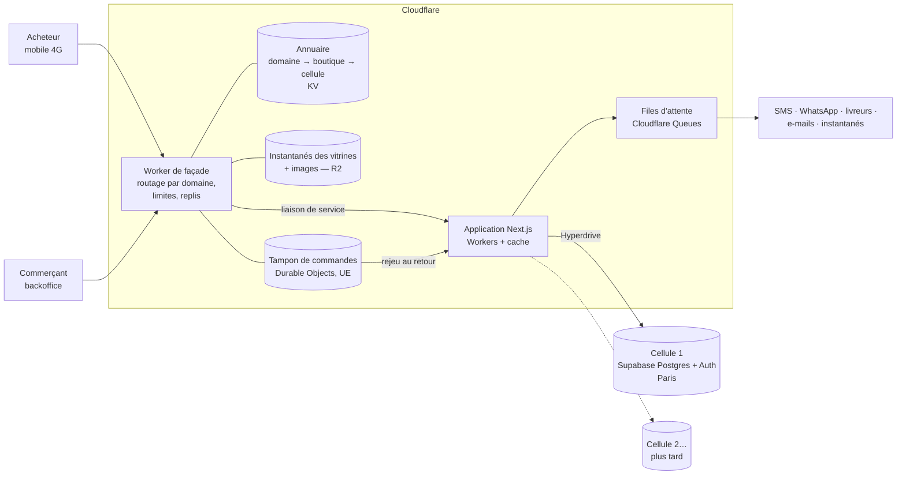

# SkanEcom — Cadrage de l'infrastructure (v0)

> Statut : **proposition à valider par Skander**. Rédigé le 28/09/2026.
> Répond aux deux exigences posées par Skander le 28/09 :
> 1. **Tenir la charge.** Si un jour on a beaucoup d'entreprises, la plateforme absorbe tout le trafic sans bloquer.
> 2. **Rester ouvert.** Le jour où le système tombe en panne, les sites des clients continuent de marcher.
>
> Chaque chiffre est soit sourcé, soit marqué **hypothèse**. Les prix des fournisseurs changent : ceux notés « à reconfirmer » doivent être vérifiés sur la grille officielle avant toute décision d'achat.

---

## 0. L'essentiel en une page

**Trois décisions de structure répondent aux deux exigences :**

1. **L'acheteur ne parle jamais directement à la base de données.** Une *façade* placée en bordure de réseau (Cloudflare, qui a un point de présence à Tunis) sert chaque boutique depuis son cache. Si l'application ou la base ne répondent plus, elle sert la dernière version connue, puis un *instantané* stocké à part. Les données vivent derrière, la vitrine reste devant.
2. **Une seule plateforme, découpée en « cellules ».** Toutes les boutiques partagent le même code. Leurs données vivent dans des cellules : une cellule, c'est une base Postgres qui porte un groupe de boutiques. On lance avec une cellule. Quand elle se remplit, on en ouvre une autre sans rien réécrire. C'est le principe des *pods* de Shopify.
3. **Tout ce qui est lent ou externe passe par une file d'attente** : SMS, WhatsApp, livreurs, e-mails, instantanés, exports. En paiement à la livraison (COD), une commande est une simple demande qui n'exige aucune validation bancaire. On peut donc **la prendre même base arrêtée** et l'enregistrer au retour. Le COD, qui semble archaïque, devient ici un atout de résilience.

**Pile retenue (Skander, 28/09/2026) : tout sur Cloudflare, sauf les données.**
- **Cloudflare** pour tout ce qui sert et calcule : DNS, CDN, domaines des clients, Worker de façade, **application Next.js sur Workers** (vitrine, backoffice, API), images sur R2, files d'attente et tampon de commandes.
- **Supabase** pour Postgres et l'authentification, en région Paris (eu-west-3).
- **Vercel n'est plus nécessaire.** Il reste le plan B si le prototype de l'étape 1 montre que Next.js tourne mal sur Workers (§8).

Le seul choix difficile à défaire, c'est l'acteur qui porte les domaines des clients : Cloudflare, dès le premier jour. L'application et la base restent déplaçables. Le code Next.js et Postgres sont standards, et R2 est compatible S3.

**Objectifs de disponibilité mensuelle :**

| Service | Objectif | Temps d'arrêt toléré par mois |
|---|---|---|
| Vitrine (consulter) | 99,95 % | ≈ 22 min |
| Prise de commande COD | 99,9 % | ≈ 44 min |
| Backoffice marchand | 99,5 % | ≈ 3 h 40 |

**Aucune commande acceptée n'est perdue.**

**Le risque n°1 n'est pas technique.** Nos fournisseurs se paient en dollars. Or la carte technologique internationale (CTI) d'une société est plafonnée à **10 000 TND par an**, soit environ 3 390 $. Une carte refusée, c'est la mise en pause des projets Supabase, et le retour de Cloudflare en offre gratuite au bout de 5 jours, avec les services payants à l'usage suspendus : **toutes les boutiques tombent en même temps** (§7). Avoir deux fournisseurs au lieu de trois réduit ce risque sans le supprimer. Il faut obtenir le **label Startup Act** avant d'atteindre environ 300 boutiques.

---

## 1. Hypothèses de charge

Aucune source fiable ne donne le nombre de vendeurs en ligne tunisiens. Les estimations de marché divergent d'un facteur 4 (voir le PRD, §2). On raisonne donc **par scénarios**, pas par parts de marché. D'après l'étude de marché, quelques milliers de boutiques à 3-5 ans est réaliste. On conçoit pour **10 000 boutiques sans refonte**, sans surinvestir au départ.

### 1.1 Profils de boutique (hypothèses)

| Profil | Part des boutiques | Visites/jour | Pages/visite | Pages vues/jour | Commandes/jour (conversion 1,5 %) |
|---|---|---|---|---|---|
| Petit vendeur (Starter) | 70 % | 150 | 4 | 600 | ≈ 2 |
| Boutique qui grandit (Pro) | 25 % | 800 | 5 | 4 000 | 12 |
| Entreprise établie (Business) | 5 % | 5 000 | 6 | 30 000 | 75 |

Le taux de conversion de 1,5 % est une **hypothèse** : aucune mesure tunisienne fiable n'a été trouvée. On la recalera sur les vraies données de Maymar.

### 1.2 Ce que ça donne par horizon

| | 100 boutiques | 1 000 boutiques | 10 000 boutiques |
|---|---|---|---|
| Pages vues/jour | 292 000 | 2,92 M | 29,2 M |
| Pages vues/s en moyenne | 3,4 | 34 | 338 |
| Pages vues/s en pic (×10) | 34 | 340 | 3 400 |
| Commandes/jour | ≈ 830 | ≈ 8 300 | ≈ 83 000 |
| Commandes/s en pic | 0,1 | 1 | 10 |
| Requêtes vers l'application en pic (95 % servies par le cache) | ≈ 2/s | ≈ 17/s | ≈ 170/s |
| Données transférées/mois (0,3 Mo effectifs par page, cache du navigateur déduit) | ≈ 2,6 To | ≈ 26 To | ≈ 263 To |

Le facteur ×10 cumule le pic du soir et les jours de campagne. S'ajoutent les pics saisonniers : Ramadan, Aïd, soldes d'été et d'hiver, rentrée scolaire, Black Friday.

### 1.3 Le vrai danger : le pic sur UNE boutique

Plus de 80 % du trafic des boutiques tunisiennes vient des publicités Meta et des influenceurs (baromètre MDWEB). Le cas dimensionnant est donc le « post viral ». Par exemple, 30 000 visites en 30 minutes sur une seule boutique :
- environ 50 pages vues/s,
- environ 600 commandes en une demi-heure, dont beaucoup sur le même produit.

Une façade en cache absorbe ce pic sans effort. Sans cache, c'est la base partagée qui encaisserait, et **toutes les autres boutiques ralentiraient**. C'est le « voisin bruyant ».

### 1.4 Ce qui casse vraiment en premier (par ordre de probabilité)

1. **La facture de bande passante, avant la technique.** Voir le §7 : c'est la raison principale de mettre Cloudflare et R2 devant.
2. **Les pages non mises en cache martelées par des robots** : recherche, filtres, calcul du panier.
3. **Les requêtes lourdes du backoffice sur la base partagée** : exports, statistiques, listes de 10 000 commandes.
4. **L'épuisement des connexions Postgres** par des milliers d'exécutions simultanées de Workers. D'où Hyperdrive, le pool de connexions de Cloudflare.
5. **Les limites des API tierces.** L'API de First Delivery, par exemple, accepte 1 requête toutes les 10 s et 100 colis par envoi ([doc First Delivery](https://www.firstdeliverygroup.com/api/v2/documentation)).
6. **La contention sur une variante très demandée.** C'est le cas le moins inquiétant : voir le §3.3.

---

## 2. Architecture cible



| Couche | Rôle | Fournisseur (reco) | Tombe si… | Impact pour l'acheteur |
|---|---|---|---|---|
| DNS et domaines | `skanecom.tn`, domaine des vitrines, domaines des clients, certificats | Cloudflare (+ Cloudflare for SaaS) | Panne mondiale de Cloudflare | Tout est inaccessible (voir §4.4) |
| Façade | Trouve la boutique à partir du domaine, sert le cache, applique les replis, prend les commandes en mode dégradé, limite les abus | Cloudflare Workers | idem | idem |
| Images | Stockage et redimensionnement des photos produit | Cloudflare R2 + Images | Panne R2 | Images absentes, texte et prix visibles |
| Application | Rendu des pages, backoffice, API, logique métier | Cloudflare Workers (Next.js via vinext ou OpenNext, §8) | Déploiement cassé ou bug applicatif | **Rien** : la façade sert le cache et les instantanés |
| Données | Boutiques, catalogue, stock, commandes, clients, comptes | Supabase Postgres + Auth, Paris | Panne Supabase ou de la région | **Rien pour consulter** ; commandes mises en tampon |
| Travail asynchrone | SMS, WhatsApp, livreurs, e-mails, instantanés, exports | Table *outbox* dans Postgres (écrite dans la même transaction que la commande) → Cloudflare Queues (livraison, réessais, débit limité) ; un balayage planifié rattrape ce qui n'est pas parti | Panne des consommateurs | Rien : les messages attendent et partent au retour |
| Plan de contrôle | Comptes marchands, abonnements, factures, annuaire des cellules | Schéma `plateforme` (dans la cellule 1 au début, isolé ensuite) | — | — |

**Pourquoi les images ne sont pas dans Supabase Storage** (où Maymar les prévoyait) : si Supabase tombe, une vitrine sans photos ne vend pas. Sur R2, les images sont servies par la même bordure que les pages, sans frais de sortie de données.

**Comment la façade parle à l'application.**
- La façade et l'application sont deux Workers du même compte. La façade appelle l'application par une *liaison de service* : un appel interne, sans passer par Internet. Elle lui transmet l'identifiant de la boutique et de sa cellule dans `ctx.props`.
- L'application a deux points d'entrée séparés :
  - **vitrine** : pages publiques, mises en cache ;
  - **backoffice** : sur `skanecom.tn`, **jamais mis en cache**, derrière l'authentification.

  Un bug ou une purge dans l'un ne touche pas l'autre.

---

## 3. Exigence 1 — tenir la charge sans bloquer

### 3.1 La lecture ne touche pas la base

- Les pages de vitrine sont **générées puis mises en cache à la bordure** (Workers Caching) : accueil, rayons, fiches produit. Objectif : **95 % au moins des pages vues servies par le cache**.
- **Piège vérifié dans la doc Cloudflare.** Le cache de Workers appartient au Worker, et **sa clé n'inclut pas le domaine**. `boutique-a.../accueil` et `boutique-b.../accueil` partageraient la même entrée. La façade doit donc passer l'identifiant de la boutique à l'application dans `ctx.props`, qui fait partie de la clé ([doc Cloudflare](https://developers.cloudflare.com/workers/cache/cache-keys/)). Un test automatique vérifie à chaque livraison que deux boutiques ne reçoivent jamais la même page.
- **L'invalidation se fait par boutique, pas par minuterie.** Quand un commerçant modifie un prix, l'application purge les étiquettes `boutique:<id>` et `produit:<id>` (`ctx.cache.purge`). Maymar régénère aujourd'hui toutes les 5 minutes (`revalidate = 300`). En multi-boutique, on passe à des durées longues avec purge ciblée.
- **Les purges sont limitées.** Celles de Workers Caching suivent les limites de l'offre gratuite, quelle que soit l'offre payée ([doc](https://developers.cloudflare.com/workers/cache/purge/)). On **regroupe donc les purges** : une par boutique toutes les 30 à 60 secondes, avec plusieurs étiquettes par appel. On garde une durée de vie de quelques minutes en filet, pour que la fraîcheur ne dépende jamais d'une seule purge.
- **Le prix et le stock affichés sont « presque frais ».** Le **prix et le stock réels sont recalculés par la base au moment de la commande**. C'est déjà le contrat de Maymar : aucune commande n'est créée côté navigateur (`commandes.sql`, décision de sécurité).
- **Recherche et filtres** : cache court à la bordure, clé = requête normalisée, limitation de débit par adresse IP. La recherche plein texte reste dans Postgres en v1. Un moteur dédié (Typesense ou Meilisearch) ne sera ajouté que si les mesures l'exigent.

### 3.2 Chaque boutique dans son couloir (voisins bruyants)

| Mécanisme | Où | Effet |
|---|---|---|
| Limite de requêtes non mises en cache, par boutique et par IP | Façade | Un robot ou une boutique virale ne sature pas l'application |
| Quotas par offre (produits, employés, SMS/mois, exports/jour) | Application (réglages de l'offre) | Coûts maîtrisés, voir le principe « tout est réglage » du PRD |
| Délai maximal par requête SQL et par rôle (`statement_timeout`) | Postgres | Une requête qui dérape est coupée, elle ne bloque pas la base |
| Exports, statistiques et imports **toujours en tâche de fond** | Files | Le backoffice ne fait jamais tourner une requête de 30 s |
| Pool de connexions | Hyperdrive (Cloudflare) devant Postgres ; pooler Supabase ([doc](https://supabase.com/docs/guides/database/connecting-to-postgres)) | Les Workers ne saturent pas les connexions |
| **Cellule dédiée** pour un client Business qui l'exige | Cellules | L'équivalent du « serveur dédié » de TikTak PRO, sans serveur à gérer |

### 3.3 Les écritures : courtes, locales, sans appel externe

- **Une commande, c'est une seule transaction courte**, exécutée par une fonction SQL (RPC). Elle recalcule les prix, réserve le stock, numérote la commande et écrit un message dans l'*outbox*. **Aucun appel externe dans la transaction** (SMS, livreur, paiement) : ils partent ensuite par la file.
- **Stock d'une variante très demandée.** Maymar réserve déjà le stock dans la même transaction, avec un verrou sur la ligne de la variante (`reservation_stock.sql`). Chaque verrou dure quelques millisecondes : **des centaines de commandes par seconde sur une même variante** restent possibles. Le pire cas du §1 est d'environ 1 à 10 commandes/s, toutes boutiques confondues, soit une marge de ×10 à ×100.
- **Numéro de commande par boutique.** On remplace la séquence globale `MAY-AAAA-00001` par un compteur par boutique, avec un préfixe réglable.
- **Idempotence.** Chaque commande porte une clé générée par le navigateur. Rejouer une commande (double clic, réseau coupé, rejeu du tampon) ne crée jamais de doublon.

### 3.4 Les cellules : grandir sans réécrire

- **Définition.** Une cellule = un projet Supabase (Postgres, Auth, pooler), dans une région donnée. Chaque boutique appartient à une seule cellule, écrite dans l'**annuaire**. L'annuaire est répliqué dans Cloudflare KV, donc lisible en bordure même si les cellules sont en panne.
- **Au lancement : une seule cellule.** Elle porte aussi le schéma `plateforme` (comptes marchands, offres, abonnements, factures), rangé à part pour pouvoir l'extraire plus tard sans chirurgie.
- **Quand ouvrir une nouvelle cellule** (seuils à calibrer par test de charge, voir §6.3) : plus d'environ 2 000 boutiques, ou un processeur au-dessus de 60 % en pic soutenu, ou plus de 200 Go de données, ou un client Business qui demande une cellule dédiée. Ces seuils sont des **hypothèses de départ**.
- **Déménager une boutique** d'une cellule à l'autre, en 4 temps :
  1. copie logique de ses lignes, filtrées par `boutique_id` ;
  2. courte coupure des écritures, pendant laquelle les commandes passent par le tampon ;
  3. bascule de l'annuaire ;
  4. vérification.

  C'est aussi la procédure de **restauration d'une seule boutique** (§4.5).
- **Condition pour que ça marche.** Toutes les tables portent `boutique_id`, et aucune requête ne croise deux boutiques. C'est une règle de conception du modèle de données (voir `03-reprise-maymar.md`).

### 3.5 Les trois paliers

| | Lancement (Maymar + bêta, ≤ 100 boutiques) | 1 000 boutiques | 10 000+ boutiques |
|---|---|---|---|
| Façade | Worker : routage, cache, replis, tampon de commandes | + limites fines par boutique, règles anti-robots | Idem, offre Cloudflare supérieure si nécessaire |
| Application | Workers, placés près de la base pour les routes qui l'interrogent beaucoup (Smart Placement) ; connexion à Postgres via Hyperdrive | Idem | Idem, par cellule |
| Données | 1 cellule, instance Small ou Medium | 1 cellule plus grosse + réplica en lecture pour le backoffice | 4-6 cellules, plan de contrôle séparé |
| Files | *Outbox* Postgres + Cloudflare Queues | Idem, consommateurs parallèles par type | Idem, par cellule |
| Domaines personnalisés | Aucun (Maymar excepté) | Cloudflare for SaaS (100 inclus, puis 0,10 $/mois par domaine) | Idem (jusqu'à 50 000 hors Enterprise) |
| Exploitation | Tableaux de bord, alertes, page de statut | + test de charge trimestriel, exercice de panne | + astreinte structurée |

Chiffres Cloudflare for SaaS : [doc Cloudflare](https://developers.cloudflare.com/cloudflare-for-platforms/cloudflare-for-saas/plans/), confirmés en août 2026.

---

## 4. Exigence 2 — les sites marchent encore quand le système tombe

### 4.1 Cinq paliers pour la consultation, dont trois de secours

À chaque requête d'une page de vitrine, la façade descend cette échelle et s'arrête au premier palier qui répond. Les paliers 1 et 2 sont le cas normal ; les paliers 3 à 5 sont les secours :

1. **Cache frais** : la page est en cache et à jour. C'est le cas normal.
2. **Application** : la page est régénérée par l'application, mise en cache, puis servie.
3. **Cache périmé** : l'application renvoie une erreur 5xx ou dépasse le délai. La façade sert la dernière version en cache, même vieille de plusieurs heures. Mécanisme standard `stale-if-error` ([doc Cloudflare](https://developers.cloudflare.com/cache/concepts/cache-control/)).
   **Réglage obligatoire.** Par défaut, chaque version déployée du Worker a son propre cache. Juste après un déploiement cassé, il n'y aurait donc rien de périmé à servir. On active le partage du cache entre versions (`cross_version_cache`) et on purge par étiquette après chaque déploiement qui change l'affichage ([doc Cloudflare](https://developers.cloudflare.com/workers/cache/configuration/)).
4. **Instantané** : la page n'est pas en cache (page rarement vue, cache vidé). La façade sert l'**instantané R2** de la boutique. C'est un HTML statique de chaque page publique, régénéré en tâche de fond après chaque modification du catalogue.
5. **Page de secours** : ni cache ni instantané. Une page simple, aux couleurs de la boutique, avec son numéro WhatsApp et son téléphone : « Notre boutique revient dans quelques minutes, écrivez-nous. »

**Détail technique décisif, vérifié dans la doc Cloudflare.** `stale-if-error` ne fonctionne qu'**en l'absence de `s-maxage`, `must-revalidate` ou `proxy-revalidate`**. Il ne se déclenche que sur les erreurs 5xx, pas sur les 404 ([doc Workers Cache](https://developers.cloudflare.com/workers/cache/configuration/)). Or Next.js pose `s-maxage` par défaut sur ses pages en ISR. **Il faut donc réécrire ces en-têtes avant la mise en cache** (`Cache-Control` avec `max-age` + `stale-if-error`, sans `s-maxage`), dans un intergiciel commun de l'application, à valider au prototype. On le teste en coupant volontairement l'application (§6.3).

### 4.2 Prendre les commandes même base arrêtée (COD)

```
Acheteur valide son panier
  → Façade : l'application répond ?
       oui → commande normale (transaction SQL, stock réservé, numéro définitif)
       non → mode dégradé :
             1. prix recalculés depuis l'instantané signé de la boutique (pas depuis le navigateur)
             2. commande écrite dans le tampon durable de la boutique (Durable Object **restreint à l'UE** : il contient nom, téléphone et adresse), avec sa clé d'idempotence
             3. l'acheteur voit : « Commande reçue. Le vendeur vous appelle pour confirmer. » + numéro provisoire
       au retour de la base → rejeu automatique, dans l'ordre d'arrivée :
             - création de la vraie commande, réservation du stock
             - si le stock manque : commande créée « à arbitrer », signalée en tête de la file de confirmation
             - le commerçant voit un bandeau « 12 commandes reçues pendant l'incident »
```

- **Pourquoi c'est acceptable en COD.** Aucun argent ne bouge au moment de la commande. La confirmation téléphonique a lieu de toute façon plus tard : c'est déjà le cycle de Maymar.
- **Paiement en ligne (Konnect, Flouci) en v1 : masqué en mode dégradé.** Pendant une panne de la base, l'acheteur se voit proposer le paiement à la livraison : on ne perd pas la vente, seulement le mode de paiement. Même règle quand un prestataire de paiement (PSP) est en panne ou gelé (voir le PRD : précédent Paymee).
- **Aucune confirmation de paiement n'est perdue, dès la v1.**
  - Les notifications de Konnect et Flouci (webhooks) arrivent **à la façade**, pas directement à la base. Elles sont écrites dans le tampon durable (UE) avant tout traitement, puis appliquées par la file.
  - Un **rapprochement automatique** interroge le PSP pour chaque paiement resté « en cours » au-delà de quelques minutes. Le PSP est la source de vérité.
  - Un acheteur qui a payé juste avant ou pendant une panne voit toujours sa commande marquée payée.
- **Plus tard, en réglage par boutique : accepter le paiement en ligne pendant une panne.** C'est faisable. La commande est mise en tampon avec le statut « paiement en cours », et le rejeu vérifie le paiement auprès du PSP. Il faut trois conditions :
  1. des identifiants PSP de la boutique disponibles en bordure, chiffrés ;
  2. une vérification du statut auprès du PSP au rejeu ;
  3. une procédure de remboursement si le stock manque au retour (API de remboursement de Konnect à vérifier).

  Ce n'est pas en v1, parce que c'est le cas où une erreur coûte de l'argent à l'acheteur.
- **Survente possible, mais bornée.** Elle ne peut dépasser que ce qui a été commandé pendant la panne. Elle se règle à l'appel de confirmation, ce qui est moins grave qu'une boutique fermée.
- **À prototyper à l'étape 1.** Durable Objects restreints à l'UE (préférés : ordre garanti par boutique, stockage durable, localisation UE vérifiée), Cloudflare Queues seulement pour acheminer ensuite. Mesure du temps de rejeu.

### 4.3 Matrice des pannes

| Panne | Ce que voit l'acheteur | Ce que voit le commerçant | Réaction automatique | Remise en service visée |
|---|---|---|---|---|
| **Base Supabase indisponible** | Boutique normale (cache et instantanés), commande « reçue, on vous appelle » | Backoffice indisponible, bandeau d'incident | Tampon de commandes, page de statut mise à jour | Quand Supabase revient ; rejeu en quelques minutes |
| **Région AWS Paris perdue** | Idem | Idem, plus longtemps | Idem | Restauration dans une autre région depuis la sauvegarde hors fournisseur : **≤ 24 h** |
| **Application en erreur** (bug, dépendance cassée) | Boutique normale (cache et instantanés), commandes en tampon | Backoffice indisponible | La façade bascule sur ses paliers de secours | Correctif ou retour arrière |
| **Notre déploiement est cassé** | Idem : la façade sert le cache, partagé entre versions (§4.1) | Idem | Retour immédiat à la version précédente (versions et déploiement progressif des Workers) | **< 5 min** |
| **Migration de base destructive** | Rien en consultation | Données faussées | Règles de migration (§4.6) + restauration à un instant donné (PITR) | **≤ 4 h** |
| **Paiement en ligne (Konnect/Flouci) en panne ou gelé** | Seul le COD est proposé | Alerte | Disjoncteur par PSP (erreurs + page de statut du PSP) | Automatique |
| **Notification de paiement reçue pendant une panne de la base** | Rien : sa commande sera marquée payée | Rien | Notification gardée dans le tampon de la façade, appliquée au retour ; rapprochement auprès du PSP | Automatique |
| **API d'un livreur en panne ou limitée** | Rien | Colis « en attente d'envoi » | La file réessaie avec des délais croissants ; bordereau PDF en repli manuel | Automatique |
| **SMS ou WhatsApp en panne** | Rien, ou message reçu plus tard | Confirmations retardées | Bascule sur le canal de secours (autre fournisseur SMS, appel manuel) | Automatique |
| **Carte refusée chez un fournisseur** | Rien au début, puis **tout tombe** (Supabase en pause, Cloudflare en offre gratuite à J+5) | — | Alertes sur le plafond CTI et les échéances ; 2 cartes de 2 banques ; crédits Supabase prépayés (§7) | Prévention |
| **Domaine .tn expiré ou incident chez l'ATI** | Plus rien sous `.tn` | — | Domaine des vitrines en gTLD indépendant de l'ATI ; renouvellement pluriannuel ; alerte d'expiration | Prévention |
| **Attaque DDoS ou robots** | Rien, ou un défi anti-robots (Turnstile) au paiement | Rien | Protection Cloudflare, limites de la façade | Automatique |
| **Fuite de données entre boutiques** | — | — | Prévention par conception (§5) ; sinon procédure d'incident et notification | Voir le runbook |
| **Panne mondiale de Cloudflare** | **Tout est inaccessible** | Idem | Voir §4.4 | Quand Cloudflare revient |

### 4.4 Les limites, dites franchement

- **La façade est un point unique.** Si Cloudflare tombe entièrement, tout tombe, comme le 18/11/2025 et le 12/06/2025. On l'accepte, pour trois raisons :
  1. Cloudflare tombe beaucoup plus rarement que l'ensemble application + base qu'il protège.
  2. Une vraie redondance multi-CDN demande un second fournisseur de DNS et de CDN, et une double gestion des certificats des domaines clients. C'est hors de portée d'une équipe minuscule en v1.
  3. C'est le compromis retenu par la plupart des plateformes de cette taille.

  **Réévaluation prévue à 1 000 boutiques.** On étudiera alors un DNS secondaire et une façade de secours.
- **« Ne jamais fermer » veut dire : consulter et commander.** Le backoffice, lui, peut s'arrêter avec la base. Un commerçant ne pourra pas modifier un prix pendant une panne de Supabase, mais ses clients continueront de commander.
- **Le rendu de la toute première visite** d'une page jamais générée ni instantanée ne peut pas survivre à une panne de l'application. D'où l'instantané systématique des pages publiques.

### 4.5 Sauvegardes et reprise

| Donnée | Mécanisme | Perte maximale de données (RPO) | Remise en service (RTO) |
|---|---|---|---|
| Commandes pendant une panne | Tampon durable en bordure | **0** | Rejeu en quelques minutes |
| Base, cas courant | Sauvegardes quotidiennes Supabase (offre Pro) | 24 h | ≤ 4 h |
| Base, dès l'étape 3 | **Restauration à un instant donné (PITR, option payante Supabase)** | Quelques minutes | ≤ 4 h |
| Base, perte du fournisseur ou de la région | **Export quotidien chiffré vers R2**, dans un compartiment restreint à l'UE. `pg_dump` est lancé par une tâche planifiée GitHub Actions : un Worker ne peut pas le faire | 24 h | ≤ 24 h |
| Une seule boutique (erreur du commerçant ou de notre part) | **Export logique quotidien par boutique** | 24 h (quelques minutes avec PITR + extraction) | ≤ 2 h, sans toucher aux autres boutiques |
| Images | R2, versionnage des objets | 0 | — |

- **Règle 3-2-1** : 3 copies, 2 supports, 1 hors du fournisseur principal.
- **Une sauvegarde non testée n'existe pas.** On fait un exercice de restauration mensuel, d'une boutique et de la base entière, dans un environnement jetable, avec un compte rendu.

### 4.6 Changer sans casser

- **Environnements** :
  - local ;
  - prévisualisation pour chaque branche ;
  - **cellule interne** : nos boutiques de test + Maymar, qui sert de **canari** ;
  - production.
- **Migrations en deux temps** (*expand / contract*). On ajoute d'abord, on bascule le code, puis on retire lors d'une version ultérieure. Jamais de `DROP` ni de renommage dans la même livraison que le code qui en dépend. Sur une base partagée par des milliers de boutiques, on n'accepte aucun verrou de table long : index créés en `CONCURRENTLY`, délais de verrou courts.
- **Les nouveautés passent par des réglages** (le principe du projet). On les active boutique par boutique, d'abord sur Maymar.
- **Déploiement progressif** : d'abord un petit pourcentage du trafic, cellule par cellule, avec retour arrière immédiat. Purge du cache par étiquette seulement une fois la nouvelle version validée.
- **Gel des déploiements** pendant les pics connus : dernière semaine du Ramadan, veille de l'Aïd, premiers jours des soldes.

### 4.7 Communiquer pendant une crise

- **Page de statut publique**, par composant (vitrines, commandes, backoffice, paiements, livreurs), hébergée **hors** de notre infrastructure.
- **Bandeau dans le backoffice** et message WhatsApp aux commerçants des cellules touchées.
- **Modèles de messages** prêts à l'emploi, en FR et en AR.
- **Argument commercial.** La panne OVH de 2017 a coupé environ 20 000 sites tunisiens ([Espace Manager](https://www.espacemanager.com/ovh-en-panne-20000-sites-web-tunisiens-et-plus-de-100000-boites-email-larret.html)). Aucun concurrent local ne publie de page de statut ni d'engagement de disponibilité (non trouvé, à vérifier). Afficher les nôtres est un différenciateur.

---

## 5. Sécurité et isolation entre boutiques

### 5.1 Le modèle

**Base partagée, `boutique_id` sur chaque ligne, RLS** (le modèle *pool*). On y ajoute trois règles qui rendent la fuite entre boutiques **impossible par construction**, et pas seulement « interdite » :

1. **Clés étrangères composites** `(boutique_id, id)`. Une ligne de commande ne peut pas pointer vers la variante d'une autre boutique : la base refuse. C'est important parce que les triggers de Maymar sont en `SECURITY DEFINER` et contournent donc la RLS.
2. **Fonctions d'autorisation par boutique.** On passe de `est_staff()` (« staff de toute la base ») à `est_membre(boutique_id, rôles)`. Elles restent dans le schéma `private`, comme le fait déjà Maymar (`durcissement_securite.sql`).
3. **Tests d'isolation automatiques en intégration continue** (pgTAP). Pour chaque table et chaque rôle, on vérifie qu'un membre de la boutique A ne lit ni n'écrit rien de la boutique B, par l'API et par les fonctions. **Un test rouge bloque la livraison.**

### 5.2 Les pièges propres à une plateforme multi-boutique

- **Le cache qui fuit.** Une page de backoffice ou de compte client en cache partagé serait servie à quelqu'un d'autre. Règles :
  - la façade ne met jamais en cache une réponse qui porte un cookie de session ou un en-tête `Authorization` ;
  - l'identifiant de la boutique fait toujours partie de la clé de cache (`ctx.props`, §3.1) ;
  - le backoffice est sur un domaine à part.
- **Les domaines.** Il faut séparer le domaine de la plateforme (`skanecom.tn` : site commercial et backoffice) du **domaine des vitrines gratuites**, et déclarer ce dernier sur la [Public Suffix List](https://publicsuffix.org/), comme Shopify l'a fait avec `myshopify.com`. Deux effets :
  - une boutique ne peut pas lire les cookies d'une autre ;
  - une boutique frauduleuse signalée par Google Safe Browsing ne fait pas signaler tout `skanecom.tn`.

  Nom du domaine des vitrines à choisir (voir `04-risques-et-decisions.md`).
- **Le contenu des commerçants.** En v1, pas de HTML, de CSS ni de JavaScript libres dans les thèmes : seulement des sections structurées. Tout texte riche passe par un filtre à liste blanche.
- **L'import d'images par URL** passe par un service isolé (risque de SSRF).

### 5.3 Identité

- **Commerçants** : authentification à deux facteurs **obligatoire** pour les propriétaires et administrateurs de boutique. Supabase Auth gère le TOTP.
- **Acheteurs.** Connexion par **code à usage unique** envoyé par SMS ou WhatsApp, ou par e-mail. Le compte obligatoire ou l'achat en invité est un **réglage de chaque boutique** (Maymar : compte obligatoire).
  - On utilise des **codes plutôt que des liens de connexion** : les liens exigent de déclarer chaque domaine de boutique comme adresse de retour autorisée, ce qui n'est pas tenable avec des milliers de domaines.
  - Les codes partent par le *Send SMS Hook* de Supabase Auth, qui permet un fournisseur régional et WhatsApp, avec repli ([doc Supabase](https://supabase.com/docs/guides/auth/auth-hooks/send-sms-hook)). On le branche sur l'agrégateur tunisien payé en dinars.
- **Une identité par personne, des données par boutique.** Un même numéro peut acheter dans deux boutiques. Chaque commerçant ne voit que « ses » clients (table `clients` par boutique).
- **Identifiants PSP et livreurs** : chiffrés par boutique (Supabase Vault). Jamais visibles en clair dans le backoffice après leur saisie.

### 5.4 Abus de la plateforme

- **Vérification légère de l'identité des commerçants** (KYC : CIN, RNE ou matricule fiscal) avant de pouvoir brancher un domaine personnalisé ou un paiement en ligne.
- **Défi anti-robots** (Cloudflare Turnstile) à l'inscription et au paiement. Limite de commandes par téléphone et par IP contre les fausses commandes COD.
- **Signalement et retrait.** Procédure écrite, délai de traitement, trace dans le journal d'audit.
- **Journal d'audit** de toutes les actions sensibles : rôles, réglages, remboursements, exports, suppressions, accès du support.

### 5.5 Où vivent les données personnelles

Nom, téléphone, adresse et commandes des acheteurs vivent :
- dans la base Supabase, à Paris ;
- dans le tampon de commandes (Durable Objects **restreints à l'UE**) ;
- dans les sauvegardes (compartiment R2 **restreint à l'UE**).

Workers KV ne propose pas de restriction géographique : il ne contient **aucune donnée personnelle**, seulement l'annuaire domaine → boutique → cellule. Les journaux des Workers ne doivent pas en contenir non plus. C'est ce périmètre, UE uniquement, qu'on déclare à l'INPDP. Sources : [Durable Objects](https://developers.cloudflare.com/durable-objects/reference/data-location/), [R2](https://developers.cloudflare.com/r2/reference/data-location/), [compatibilité](https://developers.cloudflare.com/data-localization/compatibility/).

### 5.6 Liste de contrôle avant d'ouvrir l'inscription au public

- [ ] Tests d'isolation pgTAP verts sur toutes les tables et fonctions
- [ ] Aucune clé `service_role` accessible au navigateur ; revue de toutes les fonctions `SECURITY DEFINER`
- [ ] Double authentification obligatoire pour les administrateurs de boutique
- [ ] Domaine des vitrines séparé, demande d'inscription à la Public Suffix List déposée
- [ ] Façade : pas de cache sur les réponses authentifiées, identifiant de boutique dans la clé de cache (tests automatiques)
- [ ] Turnstile et limites de débit actifs sur l'inscription, la connexion, le paiement
- [ ] Identifiants PSP et livreurs chiffrés
- [ ] Journal d'audit actif
- [ ] Sauvegarde hors fournisseur + exercice de restauration réussi
- [ ] Autorisation de l'INPDP pour le transfert des données vers l'UE (France) déposée, obtenue si possible (voir le PRD, §9 et le §5.5 ci-dessus)
- [ ] Procédure d'incident et de notification écrite

---

## 6. Exploiter avec une équipe minuscule

### 6.1 Voir

| Besoin | Outil (proposition) | Coût |
|---|---|---|
| Erreurs applicatives | Sentry | Offre gratuite au début |
| Journaux et métriques | Cloudflare (Workers Logs), Supabase (tableau de bord et métriques exportables) | Inclus |
| Sondes externes + page de statut | OpenStatus ou Better Stack | Offre gratuite ou modeste au début |
| **Parcours d'achat synthétique** : une commande test toutes les 5 min, par cellule, sur une boutique interne | Script planifié | Quasi nul |
| **Pages servies périmées** (`Cf-Cache-Status: STALE`) | Alerte sur leur proportion | Par défaut, Cloudflare sert du périmé sans limite de durée quand l'application plante : les clients ne voient rien, donc il faut que nous, on le voie |

### 6.2 Réagir

- **Indicateurs de service (SLO) par cellule et par composant**, avec des alertes sur le taux d'erreur et la latence, pas sur chaque incident isolé.
- **Qui répond.** L'agent d'exploitation trie, applique le runbook et prévient. **Skander décide** dès qu'il faut choisir entre deux mauvaises options (restaurer ou attendre, suspendre une boutique, communiquer). Les alertes critiques arrivent sur son téléphone.
- **Runbooks à écrire avant l'étape 3** :
  - base indisponible ;
  - déploiement cassé ;
  - migration ratée ;
  - carte refusée chez un fournisseur ;
  - PSP gelé ;
  - API d'un livreur hors service ;
  - boutique frauduleuse ;
  - suspicion de fuite de données ;
  - restauration d'une seule boutique ;
  - pic annoncé (Ramadan, soldes).
- **Rapport hebdomadaire automatique** : disponibilité, incidents, coûts, consommation du plafond CTI, sauvegardes testées.

### 6.3 Prouver

- **Test de charge** (k6) avant l'étape 4 puis chaque trimestre. Scénarios :
  1. journée type à l'horizon visé ;
  2. post viral sur une boutique (×100 en 5 minutes) ;
  3. 500 commandes sur une même variante ;
  4. robots sur la recherche.

  Critère de réussite : les autres boutiques ne ralentissent pas de plus de 20 %.
- **Exercice de panne** (*chaos day*) avant l'étape 4 puis chaque semestre, sur la cellule interne :
  1. couper l'application ;
  2. couper la base ;
  3. vérifier que les vitrines répondent et que les commandes passent en tampon ;
  4. vérifier que le rejeu est complet.

---

## 7. Coûts et contrainte de change

### 7.1 Ordre de grandeur mensuel (USD, hors SMS et WhatsApp refacturés)

Tous ces montants sont **à reconfirmer** sur les grilles officielles au moment de choisir. Ce sont des ordres de grandeur pour décider, pas un budget.

| Poste | Lancement (≤ 100 boutiques) | 1 000 boutiques | 10 000 boutiques |
|---|---|---|---|
| Supabase (Pro + calcul + PITR) | 30-150 | 250-600 | 2 000-6 000 (4-6 cellules) |
| Cloudflare (Workers payant, R2, Images, files, Durable Objects, for SaaS) | 5-50 | 100-350 | 1 000-3 500 |
| Observabilité et page de statut | 0-30 | 50-150 | 300-1 000 |
| **Total** | **≈ 40-200** | **≈ 400-1 100** | **≈ 3 500-10 500** |

**Repères Cloudflare** (vérifiés sur la [grille Workers](https://developers.cloudflare.com/workers/platform/pricing/) le 28/09/2026) :
- L'offre Workers payante coûte 5 $/mois et inclut 10 millions de requêtes, puis 0,30 $ par million, et 30 millions de ms de calcul, puis 0,02 $ par million de ms.
- Pas de frais de bande passante.
- **Une page vue compte deux requêtes** : la façade, puis l'appel à l'application. Les réponses servies depuis le cache sont facturées comme des requêtes, mais sans temps de calcul.
- À 1 000 boutiques, environ 90 millions de pages vues par mois donnent environ 180 millions de requêtes, soit **de l'ordre de 50 $ plus le calcul**.
- **Piège : les journaux.** Workers Logs inclut 20 millions d'événements par mois, puis 0,60 $ par million. Journaliser chaque requête coûterait plus cher que les requêtes elles-mêmes : on **échantillonne**.

**Ce que coûterait Vercel en plus (option A, plan B).** 20 à 60 $/mois au lancement, 100 à 400 à 1 000 boutiques, 1 000 à 4 000 à 10 000. Et s'il servait lui-même images et pages, sans Cloudflare devant, ce serait bien pire. À 1 000 boutiques, on transfère environ 26 To par mois (§1.2). Vercel Pro inclut environ 1 To, puis facture de l'ordre de 0,15 $ par Go (**à reconfirmer**) : **environ 3 500 $ par mois rien qu'en bande passante**, plus que tout le plafond annuel de la CTI d'une société.

### 7.2 Le plafond de change, contrainte dure

| Plafond annuel de paiement à l'étranger (CTI) | TND/an | ≈ USD/an (1 $ = 2,9508 TND, BCT, 24/09/2026) | Suffisant jusqu'à… |
|---|---|---|---|
| Société sans label | 10 000 | ≈ 3 390 | Le lancement (≤ 100-300 boutiques) |
| Société labellisée Startup Act | 100 000 | ≈ 33 900 | Environ 2 000-3 000 boutiques |
| Au-delà | Compte startup en devises, alimenté par des apports en devises (levée de fonds, recettes en devises) | — | 10 000 boutiques |

Sources : [ministère des Technologies, CTI](https://www.mtc.gov.tn/fileadmin/Investisseurs/Carte_technologique_Internationale_CTI_-version_francaise.pdf), [BCT, comptes startup en devises](https://www.agenceecofin.com/regulation/1110-60766-tunisie-la-banque-centrale-autorise-les-entreprises-technologiques-ayant-le-label-de-start-up-a-gerer-librement-leurs-comptes-en-devises).

**Ce qui se passe en cas d'impayé** (vérifié dans la doc des fournisseurs) :
- **Supabase** met les projets en pause ([FAQ facturation](https://supabase.com/docs/guides/platform/billing-faq)).
- **Cloudflare** repasse en offre gratuite au bout de 5 jours ([doc](https://developers.cloudflare.com/billing/troubleshoot/troubleshoot-failed-payments/)).

**Parades, à mettre en place avant l'étape 2 :**
1. **Déposer la demande de label Startup Act.**
2. **Prépayer des crédits Supabase** pour plus de 3 mois. Les recharges vont jusqu'à 2 000 $, n'expirent pas et sont consommées avant la carte ([doc](https://supabase.com/docs/guides/platform/credits)).
3. **Enregistrer deux cartes CTI de deux banques différentes** chez chaque fournisseur, testées avec un petit montant.
4. **Tenir un calendrier des échéances et du plafond consommé**, avec une alerte à 70 %.
5. **Écrire la procédure « carte refusée ».**
6. **Garder en réserve une option d'hébergement en Tunisie**, payée en dinars, pour une partie des services : instantanés, sauvegardes, voire données personnelles si l'INPDP l'exige. L'architecture le permet parce que les couches sont séparées.

**Le rapport coût/revenu reste sain**, à titre d'illustration seulement. Avec les fourchettes de prix *non validées* de l'étude de marché, l'abonnement moyen tourne autour de 107 TND par mois (répartition 70/25/5). À 1 000 boutiques, cela fait environ 107 000 TND par mois, soit environ 36 000 $. L'infrastructure pèse alors 1 à 3 % du revenu. **Le problème n'est pas le montant, c'est la possibilité légale de payer.**

---

## 8. Options étudiées et choix

| Critère | A. Cloudflare en façade + Vercel + Supabase | B. Tout Vercel + Supabase | **C. Cloudflare (façade + application) + Supabase : retenue** | D. 100 % Cloudflare, base D1 comprise |
|---|---|---|---|---|
| Vitrine si la base tombe | Oui (cache, instantanés) | Oui pour les pages déjà générées | **Oui** (cache, instantanés) | Oui |
| Vitrine si l'application plante | Oui | Oui pour les pages en cache | **Oui** (la façade sert ses paliers de secours) | Oui |
| Commandes si la base tombe | Oui (tampon en bordure) | Partiel (Vercel Queues, si Vercel est vivant) | **Oui** (tampon en bordure) | Sans objet (base chez Cloudflare) |
| Bande passante | Faible | **Élevée au-delà du forfait** | **Faible** | Faible |
| Fournisseurs payés en dollars | 3 | 2 | **2** | 1 |
| Coût à 1 000 boutiques (§7.1) | ≈ 500-1 500 $/mois | Le plus cher | **≈ 400-1 100 $/mois** | Le plus bas |
| Reprise du code Maymar (Next.js 16) | Totale | Totale | **Bonne, à prouver** : vinext (bêta, recommandé par Cloudflare, `vinext init` sur une app Next.js 16 existante) ou OpenNext ([doc](https://developers.cloudflare.com/workers/framework-guides/web-apps/nextjs/)) | Idem C, **plus la réécriture de toute la logique en base** |
| Base de données | Postgres | Postgres | **Postgres** | SQLite (D1) : ni RLS ni fonctions SQL ; stock, commandes et refus à réécrire dans le code ; authentification à construire soi-même |
| Point unique de défaillance | Cloudflare | Vercel | Cloudflare | Cloudflare, **données comprises** |

**Pourquoi C (décision de Skander du 28/09/2026, que je recommande aussi).**
- **Vercel ne sert plus à rien** une fois la façade chez Cloudflare. Cloudflare exécute aussi l'application. On retire un fournisseur, une facture en dollars et le montage délicat « proxy devant Vercel ».
- **La résilience ne baisse pas.** Dans l'option A, une panne mondiale de Cloudflare coupait déjà tout. Les paliers de secours et le tampon de commandes restent identiques.
- **C'est l'option la moins chère avec une base solide.** Bande passante non facturée, requêtes à quelques centimes le million.
- **Les données restent chez Supabase, pour quatre raisons :**
  1. Postgres est le bon outil pour du commerce : transactions, contraintes, RLS.
  2. Le moteur de Maymar y est déjà écrit : réservation de stock, cycle de commande, refus.
  3. On garde l'authentification (codes SMS, double facteur), les sauvegardes et le PITR.
  4. Les données ne sont pas chez le même fournisseur que la façade : un problème de compte ou de facturation chez l'un n'efface pas l'autre.
- **L'application parle à Supabase par Hyperdrive** (pool de connexions de Cloudflare) ou par l'API REST de Supabase. Smart Placement place les routes gourmandes en requêtes près de la base, à Paris.

**Pourquoi pas D (tout Cloudflare, base D1 comprise).** L'idée est séduisante : une base par boutique donne une isolation parfaite, et c'est presque gratuit à petite échelle. Mais :
- il faudrait réécrire toute la logique de Maymar sans RLS ni fonctions SQL ;
- il faudrait construire l'authentification soi-même ;
- il faudrait appliquer chaque migration à des milliers de bases ;
- on mettrait tous les œufs, données comprises, dans le même panier.

À reconsidérer pour des usages ciblés (annuaire, instantanés), pas pour le cœur.

**La condition : un prototype au début de l'étape 1, qui sert de porte de décision.**
1. Porter la vitrine Maymar sur Workers avec vinext (`vinext check`, puis `vinext init`), ou OpenNext si vinext bloque.
2. Mesurer :
   - la compatibilité ;
   - le cache et l'ISR ;
   - les images et les polices ;
   - le temps de réponse depuis la Tunisie ;
   - le coût par million de requêtes.
3. Vérifier que l'application tient dans la **limite de taille d'un Worker** (10 Mo compressés sur l'offre payante).
4. Détail favorable : on n'a pas besoin du `proxy.ts` de Next.js, puisque c'est la façade qui trouve la boutique à partir du domaine.
5. **Si le prototype échoue, on passe au plan B (option A)** : Vercel derrière la façade. On ne perd rien, puisque domaines, façade, R2 et tampon restent chez Cloudflare.

## 9. Ce qu'on construit, et quand

Les étapes correspondent à la feuille de route du PRD.

| Étape | Infrastructure livrée | Preuve de fin |
|---|---|---|
| **1. Socle** | **Prototype Next.js sur Workers (porte de décision, §8)**, modèle multi-boutique (`boutique_id`, FK composites, RLS), tests d'isolation en CI, annuaire, Worker de façade v1 (routage, clé de cache par boutique, cache partagé entre versions, en-têtes réécrits, `stale-if-error`), images sur R2, outbox + files, export quotidien hors fournisseur, Sentry | Deux boutiques de test isolées, tests verts ; application coupée → vitrines toujours servies |
| **2. Maymar en ligne** | Instantanés R2 + page de secours, tampon de commandes et rejeu, page de statut, parcours synthétique, premier exercice de restauration, parades de change en place | De vraies commandes livrées ; exercice de panne réussi sur la cellule interne |
| **3. Bêta privée** | Limites par boutique et quotas par offre, Turnstile, KYC léger, runbooks, PITR | 10-20 commerçants, aucune fuite, SLO tenus pendant 1 mois |
| **4. Lancement public** | Domaines personnalisés (Cloudflare for SaaS), domaine des vitrines sur la Public Suffix List, test de charge au pic, exercice de panne, liste de contrôle du §5.6 complète | Test de charge réussi ; label Startup déposé ; INPDP déposé |
| **5. Entreprises** | Réplica en lecture pour le backoffice et les statistiques, cellule dédiée sur demande, API publique à débit limité, webhooks signés | Un client établi en production |

---

## 10. Les outils recommandés

Règle : **le moins d'outils possible, chacun remplaçable**, et d'abord ce qui est déjà inclus chez Cloudflare et Supabase. Pas de Kubernetes, pas de serveurs à gérer, pas de microservices.

| Besoin | Outil | Pourquoi |
|---|---|---|
| Langage, dépôt | TypeScript partout, un seul dépôt (bun, déjà utilisé par Maymar) | Une seule langue pour la vitrine, le backoffice, la façade et les scripts |
| Vitrine et backoffice | Next.js 16 + React 19 + Tailwind 4 (repris de Maymar), sur Workers via vinext ou OpenNext | Reprise du code existant |
| Façade | Worker Cloudflare dédié, avec KV (annuaire), R2 (instantanés, images), Durable Objects (tampon de commandes) | §2 et §4 |
| Base, authentification | Supabase : Postgres, Auth (codes SMS, double facteur), Vault (secrets par boutique), pg_cron (maintenance) | Tout est déjà inclus ; migrations avec la CLI Supabase |
| Files d'attente | *Outbox* Postgres + Cloudflare Queues | Envoi fiable sans rien perdre si un fournisseur (SMS, livreur) est lent |
| Accès à la base depuis Workers | Hyperdrive (pool de connexions) + fonctions SQL pour les écritures | Transactions courtes, logique métier dans la base comme dans Maymar |
| Recherche | Postgres plein texte en v1 | Un moteur dédié seulement si les mesures l'exigent |
| Tests | Vitest (unitaires), **pgTAP (isolation entre boutiques)**, Playwright (parcours d'achat), k6 (charge) | Les tests d'isolation bloquent la livraison |
| Intégration et déploiement | GitHub Actions → versions Workers avec URL de prévisualisation, déploiement progressif, retour arrière | Rien à héberger soi-même |
| Erreurs | Sentry (offre gratuite au début) | Standard, compatible Workers |
| Sondes externes et page de statut | OpenStatus ou Better Stack | Hébergés hors de notre infrastructure |
| Mesure d'audience des vitrines | Cloudflare Web Analytics | Gratuit, sans cookie |
| SMS et codes | Agrégateur tunisien payé en TND (WinSMS, TunisieSMS), branché sur le *Send SMS Hook* de Supabase Auth ; un fournisseur international en secours | Moins cher et sans change |
| WhatsApp | API Cloud de Meta, en direct | Confirmation des commandes COD |
| E-mails transactionnels | Un service d'envoi standard (Resend, Brevo…), à choisir à l'étape 2 | Secondaire en Tunisie, où WhatsApp domine |
| Paiement en ligne | Konnect et Flouci, sur le compte de chaque commerçant | SkanEcom ne détient jamais les fonds |
| Factures d'abonnement | Module maison + intermédiaire TTN (TEIF) | Obligation légale |
| Anti-robots | Cloudflare Turnstile + limites de la façade | Inclus |

**Ce qu'on ne fait pas maintenant, même si c'est tentant :**
- plusieurs cellules avant d'en avoir besoin ;
- plusieurs CDN ;
- une base D1 pour le cœur ;
- un éditeur de pages libre ;
- des applications mobiles.

On **conçoit** pour 10 000 boutiques (`boutique_id` partout, façade, files), mais on **construit** pour les 20 premières.

---

## 11. Questions ouvertes et points à vérifier

1. **Next.js sur Workers** : vinext (bêta) ou OpenNext ? Compatibilité du code Maymar, cache, images. À trancher par le prototype du §8 ; sinon plan B Vercel.
2. **Tampon de commandes** : Durable Objects restreints à l'UE (préférés). Temps de rejeu à mesurer au prototype.
3. **Grilles tarifaires exactes** (Cloudflare Workers, Images, Durable Objects ; Supabase, PITR) au moment de l'achat.
4. **Taille réelle d'une cellule** : à calibrer par test de charge sur les données de Maymar.
5. **Hébergement tunisien de repli** (données personnelles, sauvegardes) : quels fournisseurs, quel prix en TND ? Utile si l'INPDP refuse ou durcit les conditions.
6. **Réévaluation multi-CDN** à 1 000 boutiques.
7. **Authentification quand il y aura plusieurs cellules.** Aujourd'hui, Supabase Auth vit dans la cellule 1. Avant d'ouvrir la cellule 2, il faut décider : authentification centralisée dans le plan de contrôle, avec des jetons reconnus par toutes les cellules, ou une authentification par cellule. À concevoir avant l'étape 5.
8. **Limites exactes des purges de cache** sur l'offre gratuite. Calibrer le regroupement des purges (§3.1).
9. **Nom du domaine des vitrines** (domaine dédié décidé le 28/09). Recommandation : un gTLD, pour ne pas dépendre de l'ATI (§4.3).

## Sources principales

- Étude marché et écosystème du 28/09/2026 (extraits dans `01-prd-v0.md` et `04-risques-et-decisions.md`)
- Cloudflare : [Cache-Control et stale-if-error](https://developers.cloudflare.com/cache/concepts/cache-control/), [Workers Cache](https://developers.cloudflare.com/workers/cache/configuration/), [Cloudflare for SaaS, offres](https://developers.cloudflare.com/cloudflare-for-platforms/cloudflare-for-saas/plans/), [OpenNext et vinext](https://developers.cloudflare.com/workers/framework-guides/web-apps/opennext/), [impayés](https://developers.cloudflare.com/billing/troubleshoot/troubleshoot-failed-payments/)
- Cloudflare, Next.js sur Workers : [vinext](https://developers.cloudflare.com/workers/framework-guides/web-apps/nextjs/)
- Vercel (plan B) : [en-têtes de cache](https://vercel.com/docs/caching/cache-control-headers), [plateformes multi-boutiques](https://vercel.com/docs/platforms/multi-tenant-platforms/quickstart), [facturation Pro](https://vercel.com/docs/plans/pro-plan/billing)
- Supabase : [connexions et poolers](https://supabase.com/docs/guides/database/connecting-to-postgres), [FAQ facturation](https://supabase.com/docs/guides/platform/billing-faq), [crédits](https://supabase.com/docs/guides/platform/credits)
- Shopify, architecture en *pods* : blog d'ingénierie de Shopify (« A Pods Architecture to Allow Shopify to Scale »)
